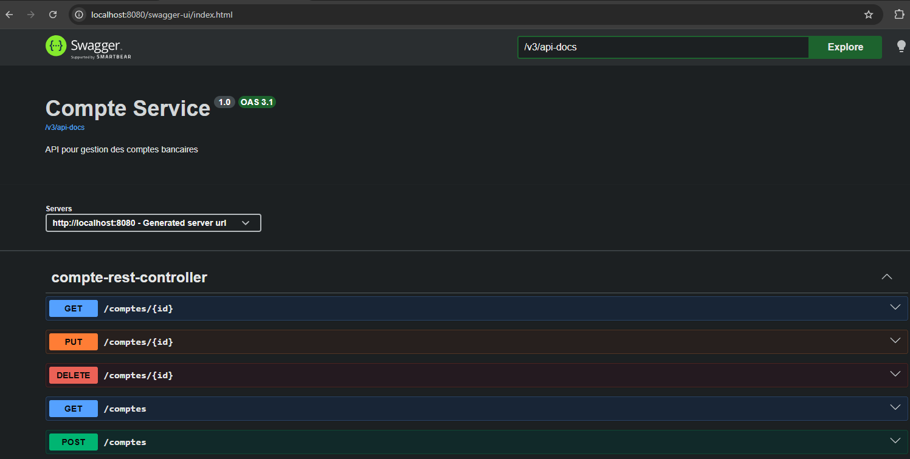
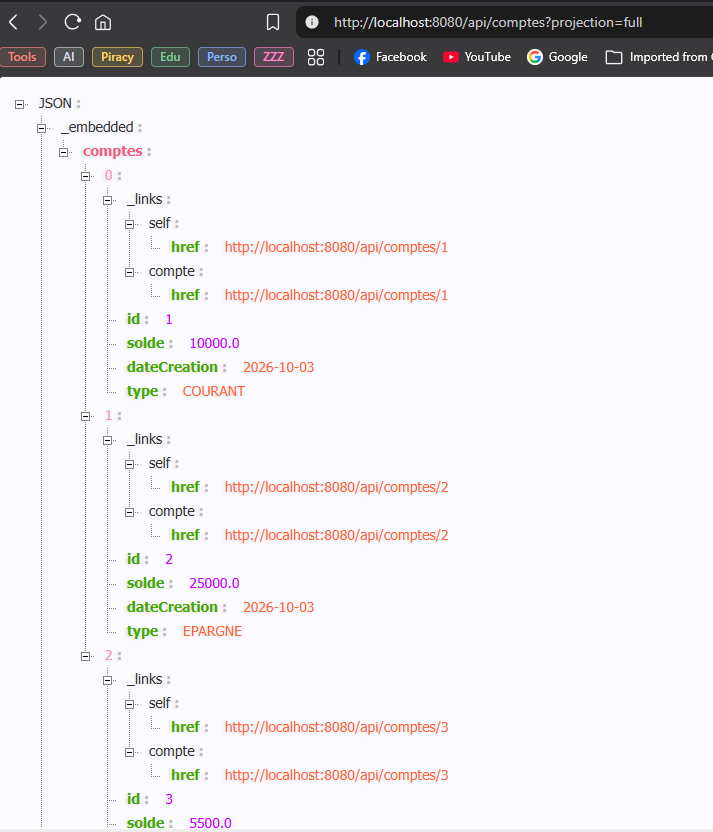
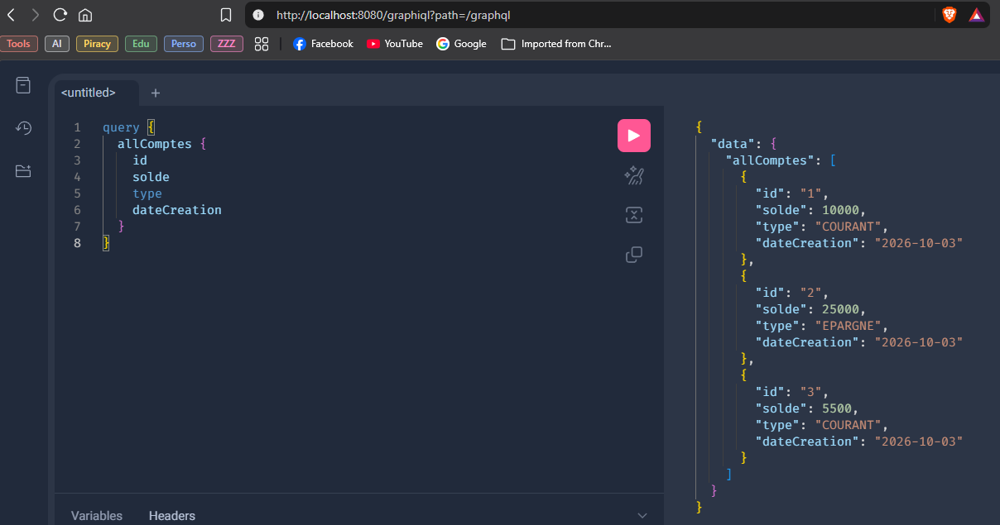
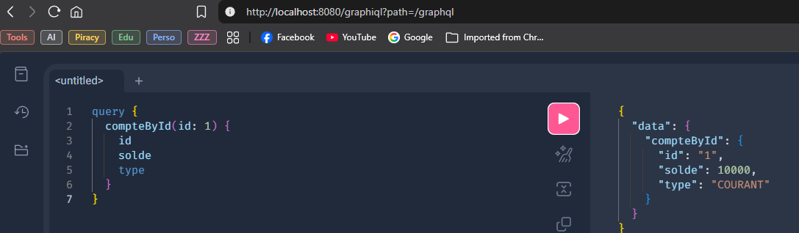
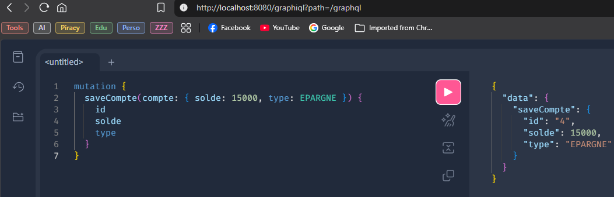

# Rapport de Travaux Pratiques : Micro-service REST & GraphQL avec Spring Boot

**Filière :** GLSID - Génie du Logiciel et des Systèmes Informatiques Distribués  
**Encadrant :** Mohamed YOUSSFI  
**Étudiant(e) :** Youness HATTABI

---

## Table des Matières

1. [Introduction](#1-introduction)
2. [Création du projet Spring Boot](#2-création-du-projet-spring-boot)
3. [Couche Entité — `Compte`](#3-couche-entité--compte)
4. [Couche DAO — `CompteRepository`](#4-couche-dao--compterepository)
5. [Test de la couche DAO](#5-test-de-la-couche-dao)
6. [Couche Service (métier)](#6-couche-service-métier)
7. [DTOs et Mappers](#7-dtos-et-mappers)
8. [Web Service RESTful](#8-web-service-restful)
9. [Documentation Swagger](#9-documentation-swagger)
10. [Exposition via Spring Data REST et Projections](#10-exposition-via-spring-data-rest-et-projections)
11. [Web Service GraphQL](#11-web-service-graphql)
12. [Tests et Résultats](#12-tests-et-résultats)
13. [Conclusion](#13-conclusion)

---

## 1. Introduction

Le paradigme des micro-services s'est progressivement imposé comme le modèle architectural dominant dans le développement d'applications d'entreprise modernes. En décomposant une application en unités fonctionnelles indépendantes, communicant via des protocoles standardisés, ce modèle offre une meilleure scalabilité, une maintenabilité accrue et une isolation des pannes.

Ce rapport présente la réalisation d'un micro-service de gestion de comptes bancaires développé avec Spring Boot 3. Le service expose ses données selon trois paradigmes distincts : une API REST classique construite manuellement avec `@RestController`, une API REST générée automatiquement par Spring Data REST avec support des projections, et une API GraphQL permettant aux clients de formuler des requêtes précises sur les données qu'ils souhaitent obtenir. La couche métier est structurée avec une interface de service et son implémentation, les transformations entre entités et DTOs étant prises en charge par MapStruct. La documentation est générée automatiquement par SpringDoc (OpenAPI 3).

---

## 2. Création du projet Spring Boot

Le projet est initialisé via [start.spring.io](https://start.spring.io) avec les paramètres suivants :

| Paramètre   | Valeur          |
| ----------- | --------------- |
| Project     | Maven           |
| Language    | Java            |
| Spring Boot | 4.0.8           |
| Packaging   | JAR             |
| Java        | 21              |
| Group       | hattabi.youness |
| Artifact    | compte-service  |

### Dépendances sélectionnées

| Dépendance           | Rôle                                                  |
| -------------------- | ----------------------------------------------------- |
| Spring Web           | Contrôleurs REST (`@RestController`)                  |
| Spring Data JPA      | Abstraction de la couche de persistance               |
| Spring Data REST     | Exposition automatique des repositories en REST HAL   |
| H2 Database          | Base de données embarquée pour le développement       |
| Lombok               | Génération automatique du boilerplate Java            |
| Spring Boot Actuator | Endpoints de monitoring (`/actuator/health`, etc.)    |
| Spring for GraphQL   | Exposition d'une API GraphQL                          |
| MapStruct            | Mapping compile-time entre entités et DTOs            |
| SpringDoc OpenAPI    | Génération automatique de la documentation Swagger UI |
| Spring Validation    | Validation des DTOs avec Bean Validation (Jakarta)    |

### Structure du projet

```
compte-service/
├── pom.xml
└── src/
    └── main/
        ├── java/net/youssfi/compteservice/
        │   ├── CompteServiceApplication.java
        │   ├── config/
        │   │   ├── OpenApiConfig.java
        │   │   └── RestRepositoryConfig.java
        │   ├── dto/
        │   │   ├── CompteRequestDTO.java
        │   │   └── CompteResponseDTO.java
        │   ├── entities/
        │   │   └── Compte.java
        │   ├── enums/
        │   │   └── TypeCompte.java
        │   ├── mapper/
        │   │   └── CompteMapper.java
        │   ├── projections/
        │   │   ├── CompteProjection.java
        │   │   └── CompteSoldeProjection.java
        │   ├── repositories/
        │   │   └── CompteRepository.java
        │   ├── service/
        │   │   ├── CompteService.java
        │   │   └── CompteServiceImpl.java
        │   └── web/
        │       ├── CompteRestController.java
        │       └── CompteGraphQLController.java
        └── resources/
            ├── application.properties
            └── graphql/
                └── schema.graphqls
```

### Configuration `application.properties`

```properties
spring.application.name=compte-service
server.port=8080

#h2
spring.datasource.url=jdbc:h2:mem:compte-db
spring.h2.console.enabled=true
spring.h2.console.path=/h2-console

spring.jpa.show-sql=true
spring.jpa.properties.hibernate.format_sql=true

#REST
spring.data.rest.base-path=/api

#SWAGGER
springdoc.swagger-ui.path=/swagger-ui.html
springdoc.enable-data-rest=false

spring.graphql.graphiql.enabled=true
spring.graphql.graphiql.path=/graphiql
```

---

## 3. Couche Entité — `Compte`

L'entité `Compte` représente un compte bancaire. Elle utilise un type énuméré `TypeCompte` pour distinguer les comptes courants des comptes épargne. Le champ `dateCreation` est de type `LocalDate` (API Java Time, préférable à `java.util.Date`). L'annotation `@Enumerated(EnumType.STRING)` garantit que la valeur de l'énumération est stockée sous forme de texte lisible en base de données plutôt que sous forme d'index ordinal, évitant ainsi des incohérences si l'ordre des valeurs venait à changer.

```java
import jakarta.persistence.*;
import lombok.*;
import hattabi.youness.compte_service.enums.TypeCompte;

import java.time.LocalDate;

@Entity
@NoArgsConstructor
@AllArgsConstructor
@Getter
@Setter
@Builder
@ToString
public class Compte {
    @Id
    @GeneratedValue(strategy = GenerationType.IDENTITY)
    private Long id;

    private double solde;

    private LocalDate dateCreation;

    @Enumerated(EnumType.STRING)
    private TypeCompte type;
}
```

```java
public enum TypeCompte {
    COURANT, EPARGNE
}
```

---

## 4. Couche DAO — `CompteRepository`

L'interface `CompteRepository` étend `JpaRepository<Compte, Long>`, ce qui fournit automatiquement toutes les opérations CRUD sans écrire une seule ligne de SQL. L'annotation `@RepositoryRestResource` active l'exposition automatique de ce repository en tant qu'API REST HAL par Spring Data REST.

Une méthode de recherche par type est déclarée : Spring Data JPA en génère l'implémentation SQL à la compilation à partir de son nom.

```java
import hattabi.youness.compte_service.entities.Compte;
import hattabi.youness.compte_service.enums.TypeCompte;

import java.util.List;

import org.springframework.data.jpa.repository.JpaRepository;
import org.springframework.data.rest.core.annotation.RepositoryRestResource;

@RepositoryRestResource
public interface CompteRepository extends JpaRepository<Compte, Long> {
    List<Compte> findByType(TypeCompte type);
}
```

---

## 5. Test de la couche DAO

Des données de test sont insérées au démarrage de l'application via un `CommandLineRunner` défini dans la classe principale. Ce bean reçoit le `CompteRepository` par injection et crée plusieurs comptes de types variés, puis les liste en console pour valider le fonctionnement de la couche de persistance.

```java
import java.time.LocalDate;

import org.springframework.boot.CommandLineRunner;
import org.springframework.boot.SpringApplication;
import org.springframework.boot.autoconfigure.SpringBootApplication;
import org.springframework.context.annotation.Bean;

import hattabi.youness.compte_service.entities.Compte;
import hattabi.youness.compte_service.enums.TypeCompte;
import hattabi.youness.compte_service.repositories.CompteRepository;

import java.util.List;

@SpringBootApplication
public class CompteServiceApplication {

	public static void main(String[] args) {
		SpringApplication.run(CompteServiceApplication.class, args);
	}

	@Bean
	CommandLineRunner commandLineRunner(CompteRepository compteRepository) {
		return args -> {
			List.of(
					Compte.builder()
							.solde(10000.0)
							.dateCreation(LocalDate.now())
							.type(TypeCompte.COURANT)
							.build(),
					Compte.builder()
							.solde(25000.0)
							.dateCreation(LocalDate.now())
							.type(TypeCompte.EPARGNE)
							.build(),
					Compte.builder()
							.solde(5500.0)
							.dateCreation(LocalDate.now())
							.type(TypeCompte.COURANT)
							.build())
					.forEach(compteRepository::save);

			System.out.println("All Comptes");
			compteRepository.findAll().forEach(System.out::println);

			System.out.println("Comptes COURANT");
			compteRepository.findByType(TypeCompte.COURANT).forEach(System.out::println);
		};
	}
}
```

Après démarrage, la console H2 est accessible à l'adresse `http://localhost:8080/h2-console` (JDBC URL : `jdbc:h2:mem:compte-db`) pour inspecter les données persistées.

---

## 6. Couche Service (métier)

La couche service isole la logique métier du contrôleur et du repository. Elle est déclarée via une interface `CompteService`, puis implémentée dans `CompteServiceImpl`. Toutes les méthodes de l'implémentation sont transactionnelles grâce à `@Transactional`, les méthodes de lecture étant marquées `readOnly = true` pour optimiser les performances (pas de dirty checking Hibernate). L'injection de dépendances se fait par constructeur (via `@RequiredArgsConstructor` de Lombok), ce qui est préférable à l'injection par champ pour la testabilité et l'immutabilité.

```java
import java.util.List;

import hattabi.youness.compte_service.dto.CompteRequestDTO;
import hattabi.youness.compte_service.dto.CompteResponseDTO;

public interface CompteService {
    List<CompteResponseDTO> getAllComptes();

    CompteResponseDTO getCompteById(Long id);

    CompteResponseDTO saveCompte(CompteRequestDTO dto);

    CompteResponseDTO updateCompte(Long id, CompteRequestDTO dto);

    void deleteCompte(Long id);
}
```

```java
import lombok.RequiredArgsConstructor;
import hattabi.youness.compte_service.dto.CompteRequestDTO;
import hattabi.youness.compte_service.dto.CompteResponseDTO;
import hattabi.youness.compte_service.entities.Compte;
import hattabi.youness.compte_service.mapper.CompteMapper;
import hattabi.youness.compte_service.repositories.CompteRepository;
import org.springframework.stereotype.Service;
import org.springframework.transaction.annotation.Transactional;

import java.time.LocalDate;
import java.util.List;

@Service
@Transactional
@RequiredArgsConstructor
public class CompteServiceImpl implements CompteService {
    private final CompteRepository compteRepository;
    private final CompteMapper compteMapper;

    @Override
    @Transactional(readOnly = true)
    public List<CompteResponseDTO> getAllComptes() {
        return compteRepository.findAll()
                .stream()
                .map(compteMapper::toDTO)
                .toList();
    }

    @Override
    @Transactional(readOnly = true)
    public CompteResponseDTO getCompteById(Long id) {
        Compte compte = compteRepository.findById(id)
                .orElseThrow(() -> new RuntimeException("Compte introuvable avec l'id: " + id));
        return compteMapper.toDTO(compte);
    }

    @Override
    public CompteResponseDTO saveCompte(CompteRequestDTO dto) {
        Compte compte = compteMapper.toEntity(dto);
        compte.setDateCreation(LocalDate.now());
        Compte saved = compteRepository.save(compte);
        return compteMapper.toDTO(saved);
    }

    @Override
    public CompteResponseDTO updateCompte(Long id, CompteRequestDTO dto) {
        Compte compte = compteRepository.findById(id)
                .orElseThrow(() -> new RuntimeException("Compte introuvable avec l'id: " + id));
        compteMapper.updateEntityFromDTO(dto, compte);
        return compteMapper.toDTO(compteRepository.save(compte));
    }

    @Override
    public void deleteCompte(Long id) {
        if (!compteRepository.existsById(id)) {
            throw new RuntimeException("Compte introuvable avec l'id: " + id);
        }
        compteRepository.deleteById(id);
    }
}
```

---

## 7. DTOs et Mappers

Les DTOs (Data Transfer Objects) séparent le contrat de l'API de la structure interne de l'entité. `CompteRequestDTO` représente les données envoyées par le client lors d'une création ou mise à jour ; `CompteResponseDTO` représente les données renvoyées au client. Cette séparation permet de faire évoluer l'entité JPA sans casser le contrat de l'API et inversement.

Le mapping entre entité et DTO est pris en charge par **MapStruct**, qui génère le code de mapping à la compilation (zéro réflexion, performances maximales). La méthode `updateEntityFromDTO` prend en paramètre `@MappingTarget` pour modifier une entité existante en place, ce qui est utile pour les opérations de mise à jour.

```java
import jakarta.validation.constraints.Min;
import jakarta.validation.constraints.NotNull;
import lombok.*;
import hattabi.youness.compte_service.enums.TypeCompte;

@Data
@NoArgsConstructor
@AllArgsConstructor
@Builder
public class CompteRequestDTO {
    @Min(value = 0, message = "Le solde doit être positif")
    private double solde;

    @NotNull(message = "Le type de compte est obligatoire")
    private TypeCompte type;
}
```

```java
import java.time.LocalDate;

import hattabi.youness.compte_service.enums.TypeCompte;
import lombok.*;

@Data
@NoArgsConstructor
@AllArgsConstructor
@Builder
public class CompteResponseDTO {
    private Long id;
    private double solde;
    private LocalDate dateCreation;
    private TypeCompte type;
}
```

```java
import hattabi.youness.compte_service.dto.CompteRequestDTO;
import hattabi.youness.compte_service.dto.CompteResponseDTO;
import hattabi.youness.compte_service.entities.Compte;
import org.mapstruct.Mapper;
import org.mapstruct.Mapping;
import org.mapstruct.MappingTarget;

@Mapper(componentModel = "spring")
public interface CompteMapper {
    CompteResponseDTO toDTO(Compte compte);

    @Mapping(target = "id", ignore = true)
    @Mapping(target = "dateCreation", ignore = true)
    Compte toEntity(CompteRequestDTO dto);

    @Mapping(target = "id", ignore = true)
    @Mapping(target = "dateCreation", ignore = true)
    void updateEntityFromDTO(CompteRequestDTO dto, @MappingTarget Compte compte);
}
```

---

## 8. Web Service RESTful

Le contrôleur REST expose cinq endpoints suivant les conventions HTTP (GET, POST, PUT, DELETE). Il délègue entièrement la logique à la couche service. Les réponses utilisent `ResponseEntity` pour contrôler précisément le statut HTTP retourné (201 Created, 404 Not Found, 204 No Content, etc.).

| Méthode | URL             | Description                  |
| ------- | --------------- | ---------------------------- |
| GET     | `/comptes`      | Lister tous les comptes      |
| GET     | `/comptes/{id}` | Obtenir un compte par son ID |
| POST    | `/comptes`      | Créer un nouveau compte      |
| PUT     | `/comptes/{id}` | Mettre à jour un compte      |
| DELETE  | `/comptes/{id}` | Supprimer un compte          |

```java
import hattabi.youness.compte_service.dto.CompteRequestDTO;
import hattabi.youness.compte_service.dto.CompteResponseDTO;
import hattabi.youness.compte_service.service.CompteService;
import org.springframework.http.HttpStatus;
import org.springframework.http.ResponseEntity;
import org.springframework.web.bind.annotation.*;

import java.util.List;

@RestController
@RequestMapping("/comptes")
public class CompteRestController {
    private final CompteService compteService;

    public CompteRestController(CompteService compteService) {
        this.compteService = compteService;
    }

    @GetMapping
    public List<CompteResponseDTO> getAllComptes() {
        return compteService.getAllComptes();
    }

    @GetMapping("/{id}")
    public ResponseEntity<CompteResponseDTO> getCompteById(@PathVariable Long id) {
        try {
            return ResponseEntity.ok(compteService.getCompteById(id));
        } catch (RuntimeException e) {
            return ResponseEntity.notFound().build();
        }
    }

    @PostMapping
    @ResponseStatus(HttpStatus.CREATED)
    public CompteResponseDTO createCompte(@RequestBody CompteRequestDTO dto) {
        return compteService.saveCompte(dto);
    }

    @PutMapping("/{id}")
    public ResponseEntity<CompteResponseDTO> updateCompte(
            @PathVariable Long id,
            @RequestBody CompteRequestDTO dto) {
        try {
            return ResponseEntity.ok(compteService.updateCompte(id, dto));
        } catch (RuntimeException e) {
            return ResponseEntity.notFound().build();
        }
    }

    @DeleteMapping("/{id}")
    public ResponseEntity<Void> deleteCompte(@PathVariable Long id) {
        try {
            compteService.deleteCompte(id);
            return ResponseEntity.noContent().build();
        } catch (RuntimeException e) {
            return ResponseEntity.notFound().build();
        }
    }
}
```

---

## 9. Documentation Swagger

SpringDoc génère automatiquement la documentation OpenAPI 3 en inspectant les contrôleurs annotés. Une classe de configuration `OpenApiConfig` personnalise le titre, la version et la description de l'API via l'annotation `@OpenAPIDefinition`.

```java
import io.swagger.v3.oas.annotations.OpenAPIDefinition;
import io.swagger.v3.oas.annotations.info.Info;
import org.springframework.context.annotation.Configuration;

@Configuration
@OpenAPIDefinition(info = @Info(title = "Compte Service", version = "1.0", description = "API pour gestion des comptes bancaires"))
public class OpenApiConfig {

}
```

La documentation interactive est accessible à l'adresse `http://localhost:8080/swagger-ui.html`. Elle permet de visualiser tous les endpoints, leurs paramètres, leurs schémas de requête/réponse, et de les exécuter directement depuis le navigateur.



---

## 10. Exposition via Spring Data REST et Projections

Spring Data REST expose automatiquement le repository `CompteRepository` à l'adresse `/api/comptes` (base-path configuré dans `application.properties`). Une classe de configuration expose les IDs dans les réponses (cachés par défaut) et configure les en-têtes CORS.

Les **projections** permettent aux clients de demander un sous-ensemble de champs via le paramètre `?projection=`. Deux projections sont définies :

- `full` — tous les champs y compris le type
- `solde` — uniquement l'ID et le solde

```java
import hattabi.youness.compte_service.entities.Compte;
import org.springframework.context.annotation.Configuration;
import org.springframework.data.rest.core.config.RepositoryRestConfiguration;
import org.springframework.data.rest.webmvc.config.RepositoryRestConfigurer;
import org.springframework.web.servlet.config.annotation.CorsRegistry;

@Configuration
public class RestRepositoryConfig implements RepositoryRestConfigurer {
    @Override
    public void configureRepositoryRestConfiguration(
            RepositoryRestConfiguration config, CorsRegistry cors) {
        config.exposeIdsFor(Compte.class);
    }
}
```

```java
import hattabi.youness.compte_service.entities.Compte;
import hattabi.youness.compte_service.enums.TypeCompte;
import org.springframework.data.rest.core.config.Projection;

@Projection(name = "full", types = Compte.class)
public interface CompteProjection {
    Long getId();

    double getSolde();

    TypeCompte getType();
}
```

```java
import hattabi.youness.compte_service.entities.Compte;
import org.springframework.data.rest.core.config.Projection;

@Projection(name = "solde", types = Compte.class)
public interface CompteSoldeProjection {
    Long getId();

    double getSolde();
}
```

**Exemples d'URLs Spring Data REST :**

| URL                                 | Résultat                      |
| ----------------------------------- | ----------------------------- |
| `GET /api/comptes`                  | Tous les comptes (format HAL) |
| `GET /api/comptes/1`                | Compte par ID                 |
| `GET /api/comptes?projection=full`  | Tous les champs               |
| `GET /api/comptes?projection=solde` | ID + solde seulement          |



---

## 11. Web Service GraphQL

GraphQL permet aux clients de demander exactement les champs dont ils ont besoin, évitant l'over-fetching (trop de données) et l'under-fetching (pas assez). Le schéma définit les types, les queries et les mutations disponibles.

### Schéma GraphQL

```graphql
type Query {
  allComptes: [Compte]
  compteById(id: ID): Compte
  comptesByType(type: TypeCompte): [Compte]
}

type Mutation {
  saveCompte(compte: CompteRequest): Compte
  deleteCompte(id: ID): Boolean
}

type Compte {
  id: ID
  solde: Float
  dateCreation: String
  type: TypeCompte
}

input CompteRequest {
  solde: Float
  type: TypeCompte
}

enum TypeCompte {
  COURANT
  EPARGNE
}
```

### Contrôleur GraphQL

Le contrôleur utilise les annotations `@QueryMapping` et `@MutationMapping` de Spring for GraphQL, qui lient automatiquement les méthodes Java aux opérations définies dans le schéma.

```java
import lombok.RequiredArgsConstructor;
import hattabi.youness.compte_service.dto.CompteRequestDTO;
import hattabi.youness.compte_service.dto.CompteResponseDTO;
import hattabi.youness.compte_service.enums.TypeCompte;
import hattabi.youness.compte_service.service.CompteService;
import org.springframework.graphql.data.method.annotation.Argument;
import org.springframework.graphql.data.method.annotation.MutationMapping;
import org.springframework.graphql.data.method.annotation.QueryMapping;
import org.springframework.stereotype.Controller;

import java.util.List;

@Controller
@RequiredArgsConstructor
public class CompteGraphQLController {
    private final CompteService compteService;

    @QueryMapping
    public List<CompteResponseDTO> allComptes() {
        return compteService.getAllComptes();
    }

    @QueryMapping
    public CompteResponseDTO compteById(@Argument Long id) {
        return compteService.getCompteById(id);
    }

    @QueryMapping
    public List<CompteResponseDTO> comptesByType(@Argument TypeCompte type) {
        return compteService.getAllComptes()
                .stream()
                .filter(c -> c.getType() == type)
                .toList();
    }

    @MutationMapping
    public CompteResponseDTO saveCompte(@Argument CompteRequestDTO compte) {
        return compteService.saveCompte(compte);
    }

    @MutationMapping
    public boolean deleteCompte(@Argument Long id) {
        compteService.deleteCompte(id);
        return true;
    }
}
```

L'interface GraphiQL (playground interactif) est accessible à `http://localhost:8080/graphiql`.

**Exemples de requêtes GraphQL :**

Query — liste tous les comptes :

```graphql
query {
  allComptes {
    id
    solde
    type
    dateCreation
  }
}
```



Query — compte par ID :

```graphql
query {
  compteById(id: 1) {
    id
    solde
    type
  }
}
```



Mutation — créer un compte :

```graphql
mutation {
  saveCompte(compte: { solde: 15000, type: EPARGNE }) {
    id
    solde
    type
  }
}
```



---

## 12. Tests et Résultats

### Récapitulatif des URLs disponibles

| Endpoint           | URL                                     |
| ------------------ | --------------------------------------- |
| API REST manuelle  | `http://localhost:8080/comptes`         |
| Spring Data REST   | `http://localhost:8080/api/comptes`     |
| Swagger UI         | `http://localhost:8080/swagger-ui.html` |
| GraphQL Playground | `http://localhost:8080/graphiql`        |
| Console H2         | `http://localhost:8080/h2-console`      |

---

## 13. Conclusion

Ce micro-service illustre la richesse de l'écosystème Spring Boot pour l'exposition de données via différents paradigmes. L'API REST manuelle offre un contrôle total sur le comportement et les codes de retour HTTP ; Spring Data REST permet une productivité maximale pour les cas simples avec des projections flexibles ; GraphQL donne aux clients la maîtrise exacte des données qu'ils reçoivent.

L'architecture en couches (entité → repository → service → contrôleur) avec DTOs et MapStruct garantit une séparation claire des responsabilités et facilite l'évolution indépendante de chaque couche. Ce service constitue la brique fonctionnelle de base sur laquelle s'appuie l'architecture micro-services complète développée en Partie 2.
